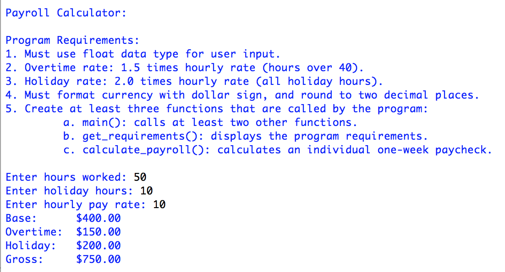

> **NOTE:** This README.md file should be placed at the **root of each of your repos directories.**
>
>Also, this file **must** use Markdown syntax, and provide project documentation as per below--otherwise, points **will** be deducted.
>

# LIS4369 - Extensible Enterprise Solutions

## Meredith McNulty

### Assignment 2 Requirements:

*Two Parts:*

1. Using functions
2. Bitbucket repo links:
	a) this assignment

#### README.md file should include the following items:

* Screenshot of a2_payroll_calculator application running *

#### Assignment Screenshots:

*Screenshot of a2_payroll_calculator application no overtime*:

*Screenshot of a2_payroll_calculator application with overtime*:

