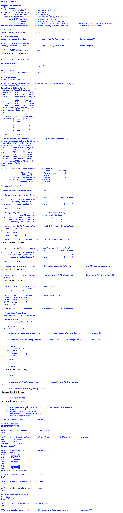

> **NOTE:** This README.md file should be placed at the **root of each of your repos directories.**
>
>Also, this file **must** use Markdown syntax, and provide project documentation as per below--otherwise, points **will** be deducted.
>

# LIS4369 - Extensible Enterprise Solutions

## Meredith McNulty

### Assignment 4 Requirements:

*Two Parts:*

1. Code and run demo.py. (Note: *be sure* necessary packages are installed!)
2. Then. use it to backward-engineer the screenshots below it.
3. Bitbucket repo links:
	a) this assignment

#### README.md file should include the following items:

* Screenshot of demo.py running *

#### Assignment Screenshots:

*Screenshot of output running*:

