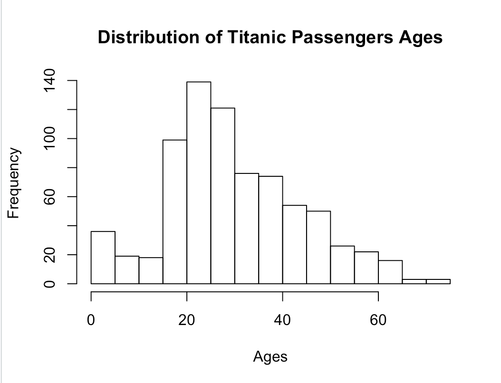
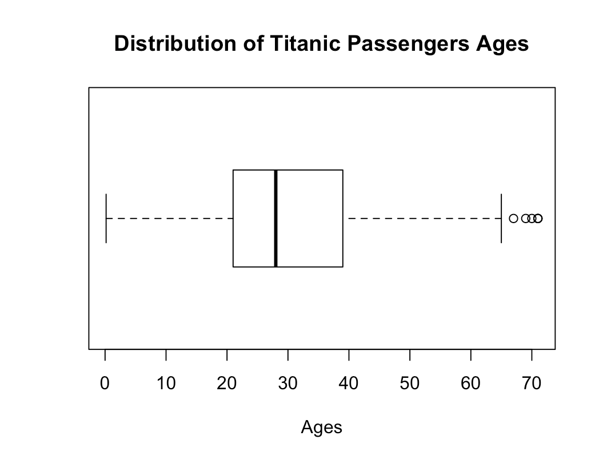
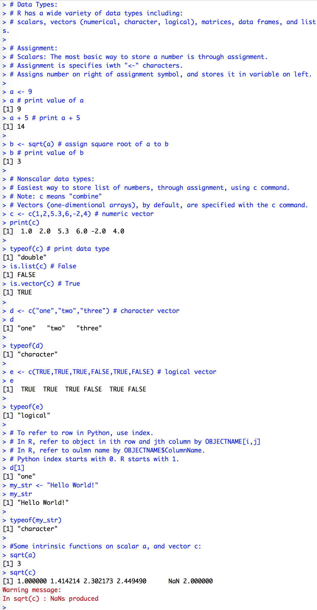

> **NOTE:** This README.md file should be placed at the **root of each of your repos directories.**
>
>Also, this file **must** use Markdown syntax, and provide project documentation as per below--otherwise, points **will** be deducted.
>

# LIS4369 - Extensible Enterprise Solutions

## Meredith McNulty

### Assignment 5 Requirements:

*Three Parts:*

1. Complete the following tutorial: Introduction_to_R_Setup_and_Tutorial 
2. Code and run lis4369_a5.R
3. Be sure to include at least two plots in your README.md file.

#### README.md file should include the following items:

* Screenshots of at least two plots
* Screenshots of output from code provided

#### Assignment Screenshots:

*Screenshot of plot 1*:

*Screenshot of plot2*:

*Screenshot of output*:

