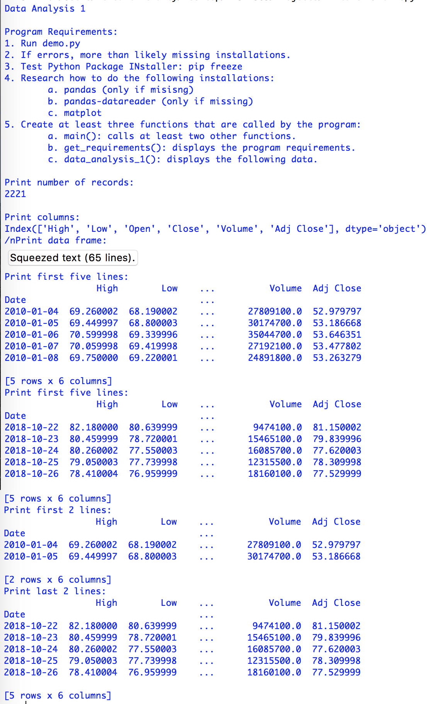
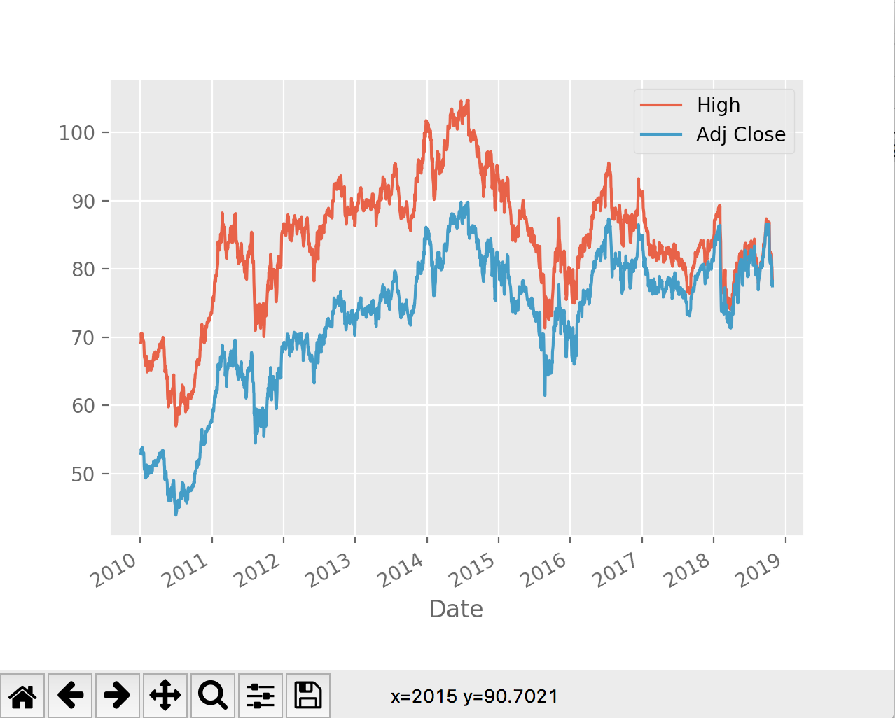

> **NOTE:** This README.md file should be placed at the **root of each of your repos directories.**
>
>Also, this file **must** use Markdown syntax, and provide project documentation as per below--otherwise, points **will** be deducted.
>

# LIS4369 - Extensible Enterprise Solutions

## Meredith McNulty

### Assignment 3 Requirements:

*Three Parts:*

1. Code and run demo.py.
2. Backward-engineer (using Python) the screenshot provided.
3. Be sure to test your program using both IDLE and Visual Studio Code.
4. Bitbucket repo links:
	a) this assignment

#### README.md file should include the following items:

* Screenshot of functions running *

#### Assignment Screenshots:

*Screenshot of functions running*:

*Screenshot of graph running*:

