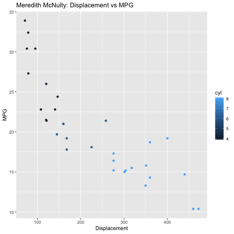
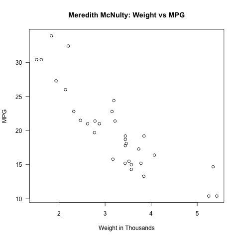

> **NOTE:** This README.md file should be placed at the **root of each of your repos directories.**
>
>Also, this file **must** use Markdown syntax, and provide project documentation as per below--otherwise, points **will** be deducted.
>

# LIS4369 - Extensible Enterprise Solutions

## Meredith McNulty

### Project 2 Requirements:

*Three Parts:*

1. Use Assignment 5 screenshots and R Manual to backward-engineer the following requirements: 
2. Resources:
	* R Manual: https://cran.r-project.org/doc/manuals/r-release/R-lang.pdf
	* R for Data Science: https://r4ds.had.co.nz/ 
3. Use Motor Trend Car Road Tests data:
	* Research the data! https://stat.ethz.ch/R-manual/R-devel/library/datasets/html/mtcars.html
	* url = "http://vincentarelbundock.github.io/Rdatasets/csv/datasets/mtcars.csv" 

#### README.md file should include the following items:

* Screenshot of functions running *

#### Assignment Screenshots:

*Screenshot of output running*:

*Screenshot of plots running*:

*Screenshot of plots running*:

